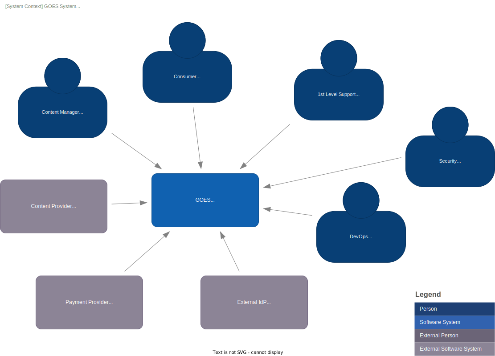
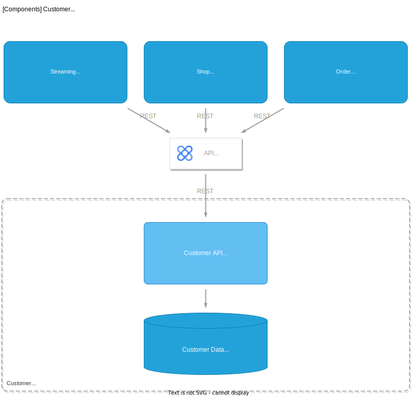

# Introduction and Goals

## Requirements Overview

### Functional Requirements:

- **Cloud Migration:**
    - Migrate at least 90% of the company's existing on-premises applications and infrastructure to a hybrid cloud environment within 24 months.
    - Migrate the core e-commerce platform, including the website, order processing system, and payment gateway, to the cloud within the first 12 months.
    - Migrate the existing content library, including on-demand videos and audio content, to cloud-based storage within 9 months.
- **Hybrid Environment Support:**
    - Ensure seamless interaction and interoperability between on-premises and cloud-based components, with a latency not exceeding 100ms for 99% of transactions.
    - Establish secure and reliable communication channels (e.g., VPN, dedicated connections) between on-premises and cloud environments.
- **Data Management:**
    - Handle a daily data ingestion rate of at least 10TB, including user data, system logs, and content metadata.
    - Ensure data recovery time objective (RTO) of less than 4 hours in case of failure.
    - Maintain a data recovery point objective (RPO) of less than 24 hours.
    - Support efficient storage and delivery of large media files (videos, audio).
    - Handle various streaming protocols, including HLS and DASH, for adaptive streaming across different devices and network conditions.
- **Scalability:**
    - Handle a peak load of 100,000 concurrent users with an average response time of less than 2 seconds.
    - Automatically scale resources up or down based on real-time traffic patterns.
    - Handle spikes in bandwidth consumption during popular content releases or live events, ensuring uninterrupted streaming for all users.
- **Security:**
    - Encrypt all sensitive customer data, including personal information and payment details, both in transit and at rest.
    - Conduct regular security audits and penetration testing to identify and address vulnerabilities.
    - Ensure compliance with relevant security standards, such as PCI DSS for payment processing and ISO 27001 for information security.
    - Implement measures to prevent unauthorized access and distribution of copyrighted content using Digital Rights Management (DRM) technologies. 

### Non-Functional Requirements:

- **Performance:**
    - Maintain system availability of at least 99.99% (less than 53 minutes of downtime per year).
    - Ensure an average response time for user requests under 2 seconds under normal load conditions.
    - Achieve low latency streaming with a target latency under 5 seconds for live streams and under 3 seconds for on-demand content.
    - Maintain high video and audio quality across different devices and network conditions, adapting to varying bandwidth availability.
- **Scalability:**
    - Scale horizontally to accommodate a 100% increase in the user base and data volume within 1 month.
    - Dynamically scale bandwidth capacity to meet fluctuating demand, especially during peak hours and special events.
- **Cost-Effectiveness:**
    - Reduce the total cost of ownership (TCO) of the hybrid cloud environment by at least 15% compared to the current on-premises infrastructure within 3 years.
    - Implement cost optimization strategies for media storage and delivery, such as using different storage tiers based on content popularity and leveraging CDN caching.
- **Security:**
    - Ensure no unauthorized access to sensitive data is detected within a 12-month period.
    - Implement robust authentication and authorization mechanisms to protect user accounts and content.
- **Maintainability:**
    - Deploy new features or updates to the system within 2 weeks.
    - Ensure a mean time to repair (MTTR) of less than 2 hours for critical system failures.
- **Flexibility:**
    - Support the integration of new technologies and services within 3 months.
    - Adapt to new streaming technologies and formats as they emerge, ensuring compatibility with evolving industry standards. 

### Assumptions:

- **Scope:** E-commerce is fucused on streaming products
- **User Base:** The company has approximately 50 million active users, with a peak concurrency of 1 million concurrent users. 
- **Peak Load:** Peak load during holiday seasons or special events can result in a 5x increase in traffic compared to normal conditions.
- **Content Library:** The company has about 10,000 hours of content in its content library of on-demand video and audio content, distributed as follows: 5% SD, 70% HD, and 25% 4K. 
- **Products** The company has about 10,000 products

### Additional conciderations

- **Content Management System (CMS):** A robust CMS will be needed to manage and organize the content library, metadata, user subscriptions, etc. This system should integrate well with the cloud environment and support efficient content ingestion, processing, and delivery.
- **Recommendation Engine:** Implementing a recommendation engine could personalize content suggestions for users, potentially improving engagement and satisfaction. This might involve machine learning models and require large datasets for training.
- **Analytics and Monitoring:** Comprehensive analytics and monitoring are crucial for tracking user behavior, content performance, and overall system health. This might involve integrating with cloud-based monitoring tools and potentially developing custom dashboards for real-time insights. 

### Data volume analysis

#### Data domains

- **Customer Data:** This includes personally identifiable information (PII) such as names, addresses, contact details, and payment information. The sensitivity of this data necessitates robust security and compliance measures, potentially influencing the decision to keep some data on-premises in a hybrid model.
- **Transactional Data:** This encompasses data related to purchases, orders, payments, and shipping. The volume and velocity of this data, especially during peak periods like holidays, require a scalable and performant architecture.
- **Product Data:** This includes product descriptions, images, videos, reviews, and inventory information. The need to efficiently store, manage, and deliver this content to a global audience might drive the use of cloud storage and content delivery networks.
- **Streaming Data:** The streaming content aspect of the business generates real-time data related to user viewing habits, content performance, and network traffic. The architecture needs to handle the ingestion, processing, and analysis of this streaming data to gain insights and optimize content delivery.
- **Log and Monitoring Data:** The operation of both on-premises and cloud infrastructure generates logs and metrics related to system performance, security events, and application behavior. The architecture needs to collect, store, and analyze this data for monitoring, troubleshooting, and security purposes. 

#### Data Privacy Conciderations

| Data Domain | Public Cloud Storage | Explanation |
|---|---|---|
| Customer Data |  No | GDPR allows for the transfer of personal data outside the EU, but only under specific conditions. These conditions include ensuring adequate safeguards are in place to protect the data, and the data processor (e.g., the cloud provider) must comply with GDPR regulations. |
| Transactional Data | Yes |  Transactional data may contain information that can be linked back to individuals.  Appropriate anonymization and encryption techniques can be implemented to ensure compliance with GDPR when storing this data on the public cloud. | 
| Product Data | Yes | This data generally does not contain personal information and is less sensitive to GDPR regulations. However, if product reviews contain personally identifiable information, that would need to be considered. |
| Streaming Data | Yes | Streaming data related to user viewing habits can be anonymized or aggregated to avoid direct identification of individuals. This data can be stored in the public cloud, but it's important to ensure appropriate security measures are in place. |
| Log and Monitoring Data | Yes | Logs and metrics related to system performance and security events are generally not considered personal data. However, if these logs contain information that can be linked back to individuals, GDPR compliance needs to be assessed. | 

> **Guideline - Technical reference to user:** A unique, anonymized identifier (e.g., a UUID) can be stored in the public cloud to reference a user. This identifier should only be linked to personal information in the on-premises systems, not in the public cloud. 

#### Data volume estimation (net)

| Data Domain | Data Volume Store | Data Volume Write per Day | Data Volume Read per Day | Comment |
|---|---|---|---|---|
| Customer Data | 100GB | 1GB | 10GB | Assuming 1KB per user for PII and payment details, 1% daily churn rate, and 10% daily active users. |
| Transactional Data | 5GB | 5GB | 1GB | Assuming 10% of users make a transaction per day, 1KB per transaction, and 20% of transactions result in customer service requests. |
| Product Data | 110GB | 1,1GB | 2,220TB | Assuming 10KB text description, 1MB images, 10MB videos per product, 10.000 products, 1% daily product updates, and 20 product views per user per day. |
| Streaming Data (Content Library) | 266.4 TB | 444 GB | 18 Tbps/hour | Assuming average bitrate of 5 Mbps across all resolutions and peak concurrency for 1 hour per day. 5% monthly content addition. |
| Log and Monitoring Data | 18 TB | 600GB | 5GB | Assuming 10KB logs per user per day, 100 GB server logs per day, and 1% of logs are accessed for analysis. 30-day retention. |

- The gross storage requirement is significantly higher than the net storage requirement due to redundancy and overhead.

## Stakeholders

1. Application Stack developer
2. Enterprise Architect
3. VP Engineering
4. A Business Person of the solution internal to our company

# Architecture Constraints

The current architecture comprises two data centers, one in America and one in Europe, with data replication facilitated by a VPN tunnel. The architecture style adheres to a three-tier model, consisting of web servers, APIs, and databases. 

# System Scope and Context

## Business Context

### Use Cases: Consumer

1. **Watch Content:** Stream video or audio content on demand or live, including selecting playback quality, subtitles, and audio tracks.
2. **Browse Content:** Discover and explore available content (e.g., movies, TV shows, documentaries, live events) based on genre, popularity, recommendations, or search.
3. **Resume Playback:** Continue watching content from where it was last paused.
4. **Login:** Authenticate user credentials (username/email and password) against the system. 
5. **Create Account:** Register for an account to access personalized features, manage subscriptions, and save watchlists.
6. **Cast to Devices:** Stream content to various devices (e.g., TV, mobile, tablet) using Chromecast or similar technologies.
7. **Purchase Content:** Buy access to premium content, individual episodes, or subscription packages. 
8. **Save Watchlist:** Add content to a watchlist for later viewing.
9. **Manage Profile:** Update personal information, payment details, and subscription plans.
10. **Rate and Review Content:** Provide feedback on content by rating or writing reviews.
11. **Contact Support:** Get assistance with technical issues, account management, or billing. 

### Use Cases: Content Manager

1. **Login** | Authenticate user credentials (username/email and password) against the system.
2. **Upload and Manage Content** | Upload new video and audio content to the system, including metadata (title, description, genre, tags, etc.). 
3. **Edit Content Metadata** | Modify existing content metadata, such as title, description, genre, tags, and release date. 
4. **Organize Content Library** | Create and manage content categories, playlists, and collections to organize the content library. 
5. **Set Content Visibility and Availability** | Control the visibility and availability of content based on region, subscription plans, and other criteria. 
6. **Manage Content Rights** | Assign and manage content rights, including copyright information, licensing agreements, and distribution permissions. 
7. **Monitor Content Performance** | Track content views, engagement metrics (e.g., watch time, completion rate), and user feedback (ratings, reviews). 
8. **Optimize Content Delivery** | Optimize content delivery by adjusting streaming settings, encoding parameters, and CDN configurations. 
9. **Manage User Subscriptions** | Create and manage subscription plans, including pricing, content access levels, and promotional offers. 
10. **Generate Content Reports** | Generate reports on content performance, user engagement, and subscription trends. 

### Use Cases: 1st Level Support

1. **Account Management:** Reset passwords, update account information, manage subscriptions.
2. **Technical Support:** Troubleshoot login issues, streaming problems, device compatibility.
3. **Billing Inquiries:** Address billing questions, payment issues, and subscription changes.
4. **Content Issues:** Report broken links, missing content, or technical problems with content playback.
5. **Escalation:**  Identify and escalate complex issues to higher-level support teams. 

### Use Cases: DevOps

1. **Infrastructure Provisioning:**  Deploy and manage the cloud infrastructure (e.g., virtual machines, storage, networking) required for the system.
2. **Application Deployment:**  Automate the deployment of applications, services, and configurations to the cloud environment.
3. **Monitoring and Logging:**  Set up and maintain monitoring tools to track system performance, identify issues, and generate alerts.
4. **Security Management:** Implement and manage security measures, including access control, vulnerability scanning, and intrusion detection.
5. **Continuous Integration and Delivery (CI/CD):**  Establish CI/CD pipelines to automate code builds, testing, and deployment.
6. **Capacity Planning and Scaling:**  Monitor resource utilization and adjust capacity to meet changing demands.
7. **Troubleshooting and Incident Management:**  Respond to system failures, troubleshoot issues, and restore service.
8. **Cost Optimization:**  Identify and implement strategies to reduce cloud infrastructure costs.

### Use Cases: Security

1. **Monitor Security Events:** Analyze security logs and alerts for suspicious activity.
2. **Investigate Security Incidents:**  Identify the root cause of security incidents and determine the impact.
3. **Tune SIEM Rules:** Adjust SIEM rules to improve detection accuracy and reduce false positives.
4. **Develop Security Reports:** Create reports on security trends, vulnerabilities, and incident response.
5. **Collaborate with Security Teams:**  Work with other security teams to share information and coordinate incident response. 
6. **Maintain SIEM Infrastructure:** Ensure the SIEM system is functioning properly and is up to date. 

## Technical Context

The system context diagram depicts the system's boundaries and its interactions with external entities, including users, external systems, and other relevant stakeholders. It provides a high-level overview of the system's scope and its relationships with the outside world. (following the C4 model level 1) 

<!-- Suggested code may be subject to a license. Learn more: ~LicenseLog:3960891731. -->
]

### Persons
- Consumer - A person who uses the system to access content or services.
- Content Manager - A person responsible for creating, editing, and managing the content within the system.
- DevOps - A person or team responsible for the deployment and maintenance of the system's infrastructure and applications.
- Security -  A person or team responsible for ensuring the confidentiality, integrity, and availability of the system.
- 1st Level Support - A person or team providing initial technical support to users of the system.

### External systems
- Content Provider - A third-party service that provides media content to the system.
- Payment Provider - A third-party service that handles financial transactions for the system (e.g., processing payments from consumers).
- external IdP (3rd party IdP) - A third-party service that manages user identities and authentication for the system (e.g., allowing users to log in with their Google, Facebook, or other existing accounts).

# Solution Strategy

The solution strategy involves defining the target architecture, creating a migration path, and adopting the new architecture. 

## Migration approach

# Building Block View

## Whitebox Overall System

Motivation  
*The whitebox view of the overall system provides a detailed breakdown of the system's internal components and their interactions. This view is essential for understanding the system's architecture in depth, identifying potential dependencies, and analyzing the flow of data and control within the system. It helps developers, architects, and other stakeholders understand how the system works at a granular level, enabling them to make informed decisions about design, implementation, and maintenance.* This view corresponds to C4 model level 2. 

### Streaming
This building block is responsible for the delivery of video and audio content to consumers. It handles tasks like encoding, transcoding, and streaming protocols. It is used by both Consumers and Content Managers. 

### Shop
The Shop building block manages the e-commerce aspects of the system, including product listings, purchase transactions, and order fulfillment. It is used by both Consumers and Content Managers.

## Order
This building block manages the order process, including order creation, fulfillment, and tracking. It is used by the Shop building block. 

### Product
This building block stores and manages product information, including metadata, pricing, and inventory. It is used by the Shop building block.

### Customer
The Customer building block stores and manages user information, including account details, preferences, and purchase history. It is used by the Shop and Streaming building blocks.

### Payment
This building block handles financial transactions, including payment processing and fraud detection. It is used by the Shop building block.

### IAM *(Identity and Access Management)*
The Identity building block manages user authentication and authorization, allowing users to log in and access system resources. It is used by all building blocks.

### Ticket System
This building block provides a system for users to report issues and request support. It is used by Consumers and 1st Level Support.

### SIEM
The SIEM building block monitors security events, analyzes logs, and detects potential threats. It is used by the Security team.

### DevOps Plattform
This building block provides tools and automation for infrastructure management, application deployment, and continuous integration/delivery. It is used by the DevOps team. 

## High level view on hybrid cloud setup

### Considerations

/TODO

### Design

 

## Domain Streaming

### Considerations
1.  **Video Encoding and Transcoding:**
    - **Complexity and Resource Intensiveness**: Video encoding and transcoding require substantial computational resources, especially for high-resolution and high-bitrate content. Maintaining real-time encoding and transcoding while ensuring optimal quality across various devices and network conditions can be challenging.
    - **Codec Selection and Optimization**: Choosing the right video codecs (e.g., H.264, H.265, AV1) and optimizing their parameters to balance compression efficiency, quality, and compatibility across different platforms is crucial.
2.  **Content Delivery Network (CDN):**
    - **Global Scalability**: Handling massive concurrent user requests and delivering content with minimal latency to a geographically distributed audience requires a robust CDN. Scaling the CDN infrastructure to accommodate traffic spikes and maintaining consistent performance across regions can be technically complex.
    - **Adaptive Bitrate Streaming (ABR)**: Implementing ABR to dynamically adjust video quality based on network conditions and user device capabilities adds complexity to content delivery. Efficiently segmenting videos into multiple bitrate representations and seamlessly switching between them during playback is a technical hurdle.
3.  **Video Player Development:**
    - **Cross-Platform Compatibility**: Building a video player that works flawlessly across various operating systems, browsers, and devices (desktops, smartphones, tablets, smart TVs) presents significant challenges. Ensuring consistent playback experience and handling platform-specific nuances can be complex.
    - **Low-Latency Playback**: Achieving low-latency playback, especially for live streaming events, requires careful optimization of the video player, streaming protocols, and network infrastructure. Minimizing buffering and ensuring smooth playback even with fluctuations in network conditions can be demanding.
4.  **Digital Rights Management (DRM):**
    - **Content Protection**: Implementing robust DRM solutions to prevent unauthorized access, copying, and distribution of content is essential. Integrating DRM technologies securely into the streaming platform while maintaining a smooth user experience can be technically challenging.
    - **License Management**: Managing DRM licenses, including issuing, renewing, and revoking them, requires a complex backend system. Ensuring efficient license management and handling various DRM ecosystems adds technical overhead.
5.  **User Management and Authentication:**
    - **Secure Authentication**: Implementing secure user authentication and authorization mechanisms to protect user accounts and prevent unauthorized access is crucial. Handling password management, multi-factor authentication, and integration with third-party identity providers can be technically involved.
    - **Subscription Management**: Managing user subscriptions, including plan upgrades, downgrades, cancellations, and payment processing, requires a robust backend system. Handling various subscription models and integrating with payment gateways adds technical complexity.
6.  **Analytics and Monitoring:**
    - **Real-time Monitoring**: Implementing real-time monitoring and analytics to track user engagement, playback quality, and system performance is crucial. Collecting, processing, and analyzing massive amounts of data in real time presents technical challenges.
    - **Quality of Experience (QoE) Measurement**: Accurately measuring and optimizing QoE, including factors like buffering, startup time, and video quality, across diverse user environments and network conditions requires sophisticated analytics tools and techniques.

### Design

Some aspects are omitted in this diagram but can be reviewed in the description of the landing zone. 

## Domain Customer

### Considerations

Domain Customer remains on premise and is interated with other domains by REST APIs.

### Design

Some aspects are omitted in this diagram but can be reviewed in the description of the landing zone. 

 

## Domain Order

### Considerations

Domain Order remains on premise and is interated with other domains by REST APIs.

### Design

Some aspects are omitted in this diagram but can be reviewed in the description of the landing zone. 

 

## Domain Products

### Considerations

#### Compute

**Assumptions**
- The current architecture utilizes containers for microservices deployed on-premises.

**Potential Migration Options**
- Google Kubernetes Engine (GKE)
- Cloud Run

**Chosen Solution: Cloud Run**

Cloud Run's alignment with the objectives of simplifying operations, improving scalability, and reducing costs makes it the preferred solution for migration. 

* **Simplified Operations:** Cloud Run's fully managed environment and serverless execution model eliminate the need for infrastructure management, allowing for a focus on application development and faster deployment cycles. 
* **Improved Scalability**: The automatic scaling capabilities of Cloud Run ensure optimal resource utilization and cost-effectiveness, particularly in scenarios with fluctuating workloads.
* **Reduced Costs**: The pay-per-use pricing model further contributes to cost optimization compared to the fixed costs associated with maintaining on-premises infrastructure or running a dedicated Kubernetes cluster.

While GKE offers greater flexibility and control, it also introduces additional operational complexity. Cloud Run's streamlined approach is considered more suitable for the current requirements, where the priority is on achieving operational efficiency and cost savings without sacrificing the benefits of containerization.

#### Database

**Asumptions**:
- 10.000 products
- 1% daily product updates -> 100 product updates per day
- 20 product views per user per day for 50 millions users
- 1 million concurrent users
- 10KB text description, 1MB images, 10MB videos per product

The assumptions made in the Data volume estimation:

| Data Domain | Data Volume Store | Data Volume Write per Day | Data Volume Read per Day | Comment |
|---|---|---|---|---|
| Product Data | 110GB | 1,1GB | 2,220TB | Assuming 10KB text description, 1MB images, 10MB videos per product, 10.000 products, 1% daily product updates, and 20 product views per user per day. |

We have different types of data, such as media and metadata, which require different databases.
Considering the requirement to scale five times and the need for replication for availability, the Products domain must meet the following data requirements: 

| Data Type | Data Volume Store | Data Volume Write per Day | Data Volume Read per Day | Comment |
|---|---|---|---|---|
| Meta data | 200MB | 5MB | 50TB | 10KB text description * 10000 products * 2 replication, 10kb * 100 updates * 5 scale, 10KB * 20 views * 50 million active users * 5 scale |
| Media data | 220GB | 5,5GB | 55PB | 11BM * 10000 products * 2 replication, 11MB * 100 updates * 5 scale, 11MB * 20 views * 50 million active users * 5 scale |

##### Meta Data 

**Elastic Cloud** is selected to fulfill the following requirements:

* **Data Storage and Management:**
    * Data Type: Product metadata
    * Data Volume Store: 200MB
    * Data Volume Write per Day: 5MB
    * Data Volume Read per Day: 50TB

* **User Experience:**
    * Advanced product search capabilities, including:
        * Fuzzy search
        * AI-powered search
        * Autocomplete
    * Personalized product recommendations

**Rationale:**

Elasticsearch, while powerful for search, can be complex to deploy and scale, requiring dedicated technical expertise. Elastic Cloud simplifies this by providing a managed service, allowing you to focus on leveraging Elasticsearch's advanced search capabilities, like full-text search, faceted navigation, and relevant result ranking, without the operational overhead.

**Additional Benefits:**

* Scalability: Elastic Cloud can easily scale to accommodate growing data volumes and user traffic.
* Managed Service: Reduces operational overhead and eliminates the need for in-house Elasticsearch expertise.
* High Availability: Ensures reliable access to product data and search functionality.

**Implementation Notes:**

* Product metadata will be indexed and stored in Elasticsearch indices within Elastic Cloud.
* Search and recommendation APIs will be utilized to power the product search and recommendation features in the application.

**Concequences**

- The microservices will need to be adapted to use Elasticsearch SQL, as it offers a limited feature set. 

##### Media Data

Based on the significantly larger data volume and the unstructured nature of media data (videos and images), Cloud Storage emerges as the most appropriate solution on GCP.

- **Key advantages of Cloud Storage:**
    - **Massive Scalability:** Cloud Storage is designed to handle petabytes or even exabytes of data, making it well-suited for storing and serving vast amounts of media content.
    - **Object Storage:** Media files are typically stored as objects, and Cloud Storage provides a simple and scalable object storage interface, aligning perfectly with this requirement.
    - **High Performance:** Cloud Storage offers various storage classes with different performance characteristics, allowing for a balance between cost and performance based on specific access patterns.
    - **Global Accessibility:** Media content often needs to be accessed from various locations, and Cloud Storage's global network ensures fast access to your media data from anywhere in the world.
    - **Integration with other GCP services:** Cloud Storage integrates seamlessly with other GCP services like Cloud CDN for content delivery, Cloud Vision API for image analysis, and Transcoder API for video processing. This allows for building a complete media management and delivery pipeline on GCP.
- **Additional Considerations:**
    - **Storage Classes:** Choosing the appropriate storage class (Standard, Nearline, Coldline, Archive) based on access patterns and cost considerations is crucial.
    - **Data Organization:** Organizing media data using buckets and object names ensures efficient retrieval and management.
    - **Content Delivery:** Consider using Cloud CDN to optimize the delivery of media content to users around the world. 

#### Multi Region aspects

Cloud Storage, and Elastic Cloud provide out-of-the-box multi-region setup. For deployment in a multi-region setup, follow the best practices recommended by these services. 

#### Integration with domain Order

Domain Order remains on premise and is intergated with other domains by REST APIs. The challenge there is to prevent customer data leakage into public cloud. 
- **Elastic Cloud supports several mechanisms to obfuscate data privacy-relevant fields:**
    - **Field-Level Security:** Restricts access to sensitive fields based on user roles and permissions.
    - **Data Masking and Anonymization:** Transforms sensitive data before indexing, using techniques like hashing or encryption.
    - **Pseudonymization:** Replaces identifying information with artificial identifiers to enable analysis while preserving privacy.
    - **Aggregation and Reporting:** Allows deriving insights from data without exposing individual records or sensitive fields. 

### Design

Some aspects are omitted in this diagram but can be reviewed in the description of the landing zone. 

 

## Domain Shop

### Considerations

#### Compute

**Assumptions**
- The current architecture utilizes containers for microservices deployed on-premises.

**Potential Migration Options**
- Google Kubernetes Engine (GKE)
- Cloud Run

**Chosen Solution: Cloud Run**

Cloud Run's alignment with the objectives of simplifying operations, improving scalability, and reducing costs makes it the preferred solution for migration. 

Domain Shop provides two web applications:
- Shop for Consumers
- Shop for Content Managers

The reason for separating them is fundamentally different authorization requirements. 

Both applications use Memorystore to maintain user session e.g tokens and cache.

Business logic is implemented in the Shop API which uses Firestore to maintain user profiles. This Shop API is used by Streaming Domain to manage subscriptions and purchases. 

#### Database

**Assumptions:**
- 50 million active users
- 1 million concurrent users
- 10KB user profile size
- 1% of users update their profile daily
- One user profile read per user session 

| Data Domain | Data Volume Store | Data Volume Write per Day | Data Volume Read per Day | Comment |
|---|---|---|---|---|
| User Profile | 1TB | 25GB | 2,5TB | 10KB user profile size * 50 million users * 2 replication, 10KB * 50 million users * 1% * 5 scale | 10KB * 50 million users * 5 scale | 

Based on the provided data, Firestore appears capable of handling the projected requirements. It comfortably accommodates the estimated 1TB of user profile data and the 25GB of daily writes. While the estimated 2.5TB of daily reads might approach Firestore's limits under peak usage or with complex queries, the platform's automatic scaling should generally manage this load. Additionally, Firestore's design inherently supports high levels of concurrency, suggesting it can handle the anticipated 1 million concurrent users, provided the data model and queries are optimized. 

### Multi Region aspects

Firestore provides out-of-the-box multi-region setup. For deployment in a multi-region setup, follow the best practices recommended by these services. 

### Design

Some aspects are omitted in this diagram but can be reviewed in the description of the landing zone. 

 

# Deployment View

## Infrastructure Level 1

***\<Overview Diagram>***

Motivation  
*\<explanation in text form>*

Quality and/or Performance Features  
*\<explanation in text form>*

Mapping of Building Blocks to Infrastructure  
*\<description of the mapping>*

## Infrastructure Level 2

### *\<Infrastructure Element 1>*

*\<diagram + explanation>*

### *\<Infrastructure Element 2>*

*\<diagram + explanation>*

…

### *\<Infrastructure Element n>*

*\<diagram + explanation>*

# Cross-cutting Concepts

## *\<Concept 1>*

*\<explanation>*

## *\<Concept 2>*

*\<explanation>*

…

## *\<Concept n>*

*\<explanation>*

# Architecture Decisions

# Quality Requirements

## Quality Tree

## Quality Scenarios

# Risks and Technical Debts

# Glossary

| Term        | Definition        |
|-------------|-------------------|
| *\<Term-1>* | *\<definition-1>* |
| *\<Term-2>* | *\<definition-2>* |

# References
* Arc42 Template Created, maintained and © by Dr. Peter Hruschka, Dr. Gernot Starke and
contributors. See <https://arc42.org>.
